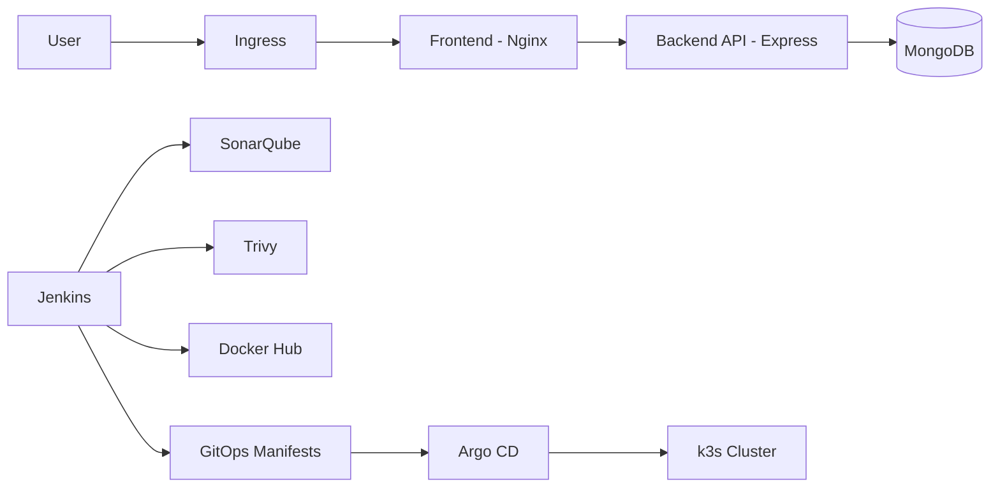
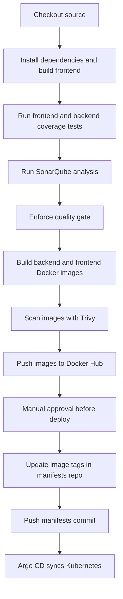

# GymFlex DevOps Platform

Source repository for GymFlex, built as part of the NT548 coursework. It
contains the application code, Jenkins pipeline, Dockerfiles, Kubernetes
manifests, Argo CD definitions and Terraform configuration used to build and
deploy a full-stack application.

## 📚 Table of Contents

- [✨ Highlights](#highlights)
- [🏗️ Architecture](#architecture)
- [🚀 CI/CD Flow](#cicd-flow)
- [⚙️ Jenkins Pipeline](#jenkins-pipeline)
- [🧪 Quality and Security Gates](#quality-and-security-gates)
- [🐳 Container Images](#container-images)
- [☸️ Kubernetes and GitOps](#kubernetes-and-gitops)
- [☁️ Infrastructure](#infrastructure)
- [📁 Repository Structure](#repository-structure)
- [🧩 Application Context](#application-context)
- [💻 Local Run](#local-run)
- [🔗 Related Repository](#related-repository)

<a id="highlights"></a>

## ✨ Highlights

- Jenkins pipeline for build, test, scan, package and deployment handoff.
- SonarQube analysis with quality gate enforcement.
- Trivy image scanning for high and critical vulnerabilities.
- Docker image publishing to Docker Hub.
- Manual approval before deployment.
- GitOps manifest updates through a separate manifests repository.
- Argo CD automated sync to a k3s Kubernetes cluster.
- Terraform modules for AWS infrastructure provisioning.

<a id="architecture"></a>

## 🏗️ Architecture



The application is intentionally used as a workload for the delivery platform.
The main focus of this repository is the CI/CD, image security, GitOps and
infrastructure automation around it.

<a id="cicd-flow"></a>

## 🚀 CI/CD Flow



Images are tagged with the Jenkins build ID, for example `v46`.

<a id="jenkins-pipeline"></a>

## ⚙️ Jenkins Pipeline

The `Jenkinsfile` runs on a Jenkins agent and defines the delivery workflow.

| Stage | Purpose |
| --- | --- |
| `Cleanup` | Clean the Jenkins workspace |
| `Checkout` | Pull source code |
| `Install & Build` | Install dependencies and build the frontend |
| `SonarQube Analysis` | Run coverage tests and static analysis |
| `Quality Gate` | Stop the pipeline if SonarQube fails |
| `Build Images` | Build backend and frontend Docker images |
| `Trivy Scan` | Block high and critical image vulnerabilities |
| `Push Images` | Push images to Docker Hub |
| `Approval Before Deploy` | Require manual approval |
| `Update manifests repo` | Replace image tags in GitOps manifests |
| `Push manifests repo` | Commit and push updated manifests |

<a id="quality-and-security-gates"></a>

## 🧪 Quality and Security Gates

Quality checks:

- Frontend coverage through `npm run test:coverage`.
- Backend coverage through `npm run test:coverage`.
- SonarQube analysis through `sonar-project.properties`.
- SonarQube quality gate with pipeline blocking.

Security checks:

- Trivy scans backend and frontend images.
- The pipeline fails on `CRITICAL` and `HIGH` vulnerabilities.
- `.trivyignore` is used for explicitly ignored findings.

<a id="container-images"></a>

## 🐳 Container Images

The pipeline builds and publishes two images:

| Component | Image |
| --- | --- |
| Backend | `noseyug/gymflex-backend:v<BUILD_ID>` |
| Frontend | `noseyug/gymflex-frontend:v<BUILD_ID>` |

The frontend image serves the React build through Nginx. The backend image runs
the Express API on port `4000`.

<a id="kubernetes-and-gitops"></a>

## ☸️ Kubernetes and GitOps

Kubernetes resources are organized under `k8s/`:

- `k8s/apps/` contains application workloads.
- `k8s/infra/` contains supporting infrastructure values and manifests.

Deployment details:

- Namespace: `devops-dev`.
- Frontend replicas: `2`.
- Backend replicas: `2`.
- Frontend Ingress host: `13.229.121.179.nip.io`.
- Backend connects to MongoDB through `mongodb-service`.
- RollingUpdate strategy is configured for frontend and backend.
- Liveness and readiness probes are configured for both services.

Argo CD application definitions are stored under `argocd/` and point to the
separate GitOps manifests repository.

<a id="infrastructure"></a>

## ☁️ Infrastructure

Terraform configuration is stored under `terraform/`.

It provisions AWS infrastructure for:

- VPC networking.
- Jenkins server.
- Jenkins agent.
- SonarQube server.
- k3s host.

See `terraform/README.md` for Terraform module details and commands.

<a id="repository-structure"></a>

## 📁 Repository Structure

```text
backend/                    # Express API, models, routes and tests
frontend/                   # React client and tests
k8s/                        # Kubernetes app and infra manifests
argocd/                     # Argo CD Application definitions
terraform/                  # AWS infrastructure as code
Jenkinsfile                 # CI/CD pipeline
sonar-project.properties    # SonarQube configuration
.trivyignore                # Trivy ignore rules
```

<a id="application-context"></a>

## 🧩 Application Context

GymFlex is a full-stack fitness commerce application used as the workload for
the DevOps platform.

| Component | Technology |
| --- | --- |
| Frontend | React, Redux, Ant Design |
| Backend | Node.js, Express, Mongoose |
| Database | MongoDB / MongoDB Atlas |
| Deployment | Docker, Kubernetes, Argo CD |
| CI/CD | Jenkins, SonarQube, Trivy |
| Infrastructure | Terraform on AWS |

Main backend route groups:

```text
/api/user
/api/product
/api/blog
/api/categories
/api/exercise
/api/order
/api/cart
/api/coupon
/api/address
/api/reviews
```

<a id="local-run"></a>

## 💻 Local Run

Frontend:

```bash
cd frontend
npm ci
npm start
```

Backend:

```bash
cd backend
npm ci
copy ..\.env.example .env
npm run dev
```

Local ports:

- Frontend: `3000`
- Backend: `4000`

<a id="related-repository"></a>

## 🔗 Related Repository

[NT548-Group11/Manifests](https://github.com/NT548-Group11/Manifests) contains
the GitOps Kubernetes manifests updated by the Jenkins pipeline.
